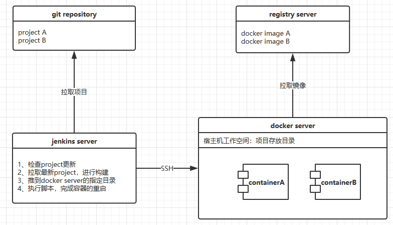

* content
{:toc}


　　实现服务容器化能极大提高CI\CD的效率，利用git+jenkins+docker+registry能提供一套比较简单的实现方案，如果对docker和jenkins比较熟悉，实现过程会非常简单。


### 背景

　　CI\CD，即持续集成\持续部署，而jenkins就是一个持续集成工具。docker是容器，registry是容器镜像仓库。由它们集成可以实现服务容器化CI\CD的需求，也是目前自动化运维的一个主要实现手段。

### 环境准备

　　一台服务器就可以完成实验，但建议至少两台服务器，这样能够多了解生产环境应该如何去部署服务器。

　　registry是一个镜像仓库，用来存放我们项目的运行环境镜像。git仓库可以选择官方或者公司或者自己搭建的私有库，jenkins负责拉取最新项目，进行构建并发布到docker服务器上，执行镜像的启动，docker服务器负责从registry拉取镜像，并作为容器运行的宿主机。下面一张图可以简要表述大概的工作流程：



　　根据上图，所有的模块都可以运行在docker容器中，所以，一台服务器也是可以完成实验的，可根据条件自行选择。

### 部署

　　部署过程可以直接分为4步，分别去构建上图中的4个部分。

#### docker

　　首先安装docker，在centos7的环境中，命令如下：

```yum -y install docker```

　　安装了docker之后，就可以开始使用docker命令安装其他的模块，如果是不同的机器，则需要在使用docker的服务器上都安装docker。

#### git repository

　　git仓库，其实不用自己搭建，用公司的或者官方的都可以。如果实现想自己搭，就先在服务器上安装git，选择一个目录执行```git --bare init```命令，仓库就建立好了。如何上传项目就不细说了，网上教程很多。

#### registry

　　registry是docker官方提供的仓库镜像，因此通过docker可以直接执行。
```docker run -d -v /opt/registry:/var/lib/registry -p 5000:5000 --restart=always --name registry registry```

　　可以通过```docker ps```命令查看registry是否已经启动执行了。这是私人的镜像仓库，默认暴露的端口号是5000，使用docker通过push命令可以将docker镜像发送到registry。

　　如果想要把docker镜像提交到私有registry，则需要修改使用docker提交的服务器的一个配置 ```vim /etc/docker/daemon.json```，需要在该文件中加上registry的地址：

```
{
  "registry-mirrors": [ "https://registry.docker-cn.com"], //国内镜像源
  "insecure-registries": [ "registry的ip:5000"]
}
```

#### jenkins

　　依旧通过docker容器来起jenkins服务。可以去查找官方的基础镜像，这东西和maven提供的依赖非常类似。当然也可以自己去构建一个镜像，然后自己启动。以下内容是一个jenkins的Dockerfile：

```
FROM jenkins
USER root
RUN echo '' > /etc/apt/sources.list.d/jessie-backports.list && \
wget http://mirrors.163.com/.help/sources.list.jessie -O /etc/apt/sources.list
RUN apt-get update && apt-get install -y git
```

　　在这里不解释太多关于Dockerfile的东西，内容太多，而且是必须要经过学习的。

### 自动化CI\CD

　　通过之前的那张图可以看到，主要的工作由jenkins完成。（其中插件可以自行安装）

1. 完成jenkins和gitlab的通信，使jenkins能访问到gitlab。

2. 完成jenkins通过SSH访问到docker服务器。

3. 通过jenkins完成项目的构建。

4. 通过jenkins执行shell脚本完成项目所在docker容器的启动。

　　非常简单的描述了大致的工作。主要工作都是在jenkins中配置，这里就只贴项目运行的基础镜像的Dockerfile和jenkins部署容器的shell脚本。

#### 基础镜像Dockerfile

　　这是项目运行的基础镜像Dockerfile，如果是Springboot项目，环境中只需要有个JDK就可以了，如果有特殊的需求，也可以在Dockerfile文件中列出来。

```
#基础镜像为centos
FROM centos:latest
#挂载宿主机镜像到容器的PATH中
ENV PATH /usr/local/jdk/bin:$PATH
#暴露8089端口
expose 8089
#容器启动时执行命令
CMD ["/usr/local/jdk/bin/java", "-jar","/demo/demo-0.0.1-SNAPSHOT.jar"]
```

#### jenkins部署容器脚本

　　jenkins通过SSH连接到docker容器运行的服务器上，然后通过shell脚本对容器的启动和停止删除进行操作。

```
docker rm -f shorturl
docker rmi -f 192.168.2.49:5000/demo:v1
docker run -itd \
--name shorturl \
-p 8089:8080 \
-v /usr/local/jdk1.8.0_181:/usr/local/jdk \
-v /demo:/demo \
192.168.2.49:5000/demo:v1
```

　　脚本的内容比较简单，就不详细说明了。

### 参考

[实战docker+jenkins+git+registry构建持续集成环境](http://blog.51cto.com/ganbing/2085769)